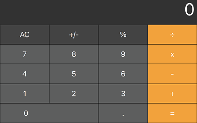

# Calculator built with React

[](https://badge.fury.io/js/simple-react-calculator)




[Demo](https://react-calculator-x.vercel.app/)

It is a calculator like Mac OS.

Scientific Calculator is not supported.

## Install

To use simple-react-calculator, all you need to do is install the simple-react-calculator package and its peer dependencies.

```
npm install simple-react-calculator @emotion/react @emotion/styled
```

or

```
yarn add simple-react-calculator @emotion/react @emotion/styled
```

## Usage

```tsx
import { ReactCalculator } from "simple-react-calculator";

const Example = () => {
  return <ReactCalculator />;
};
```
